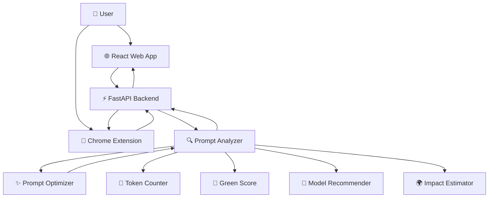
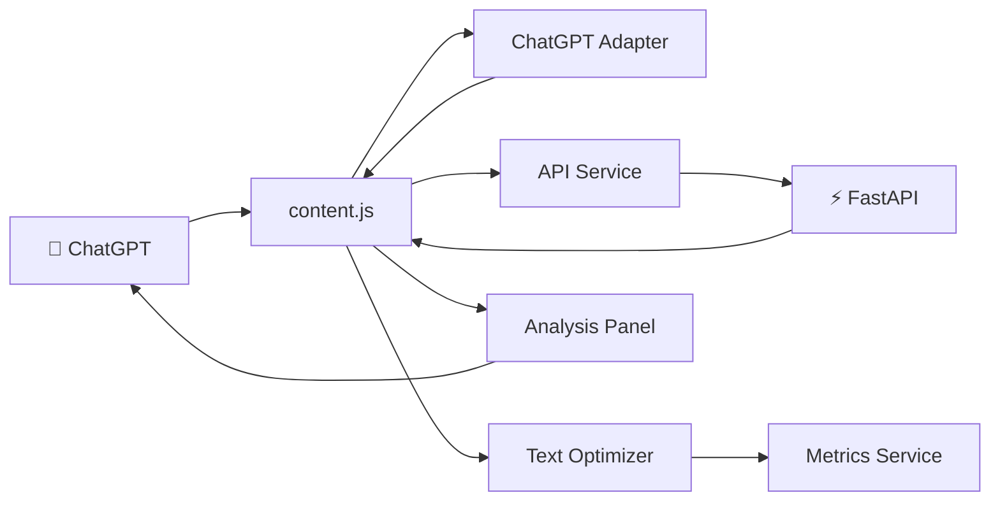
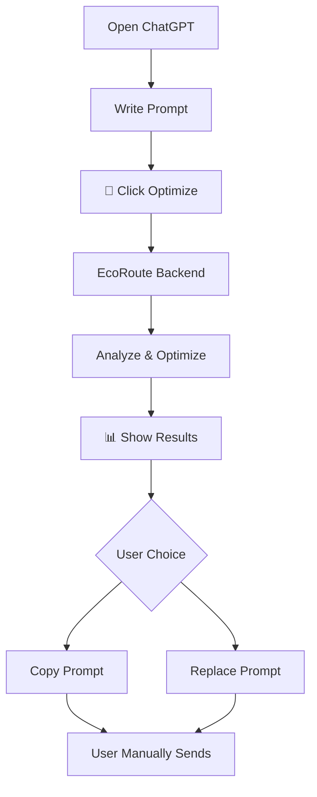
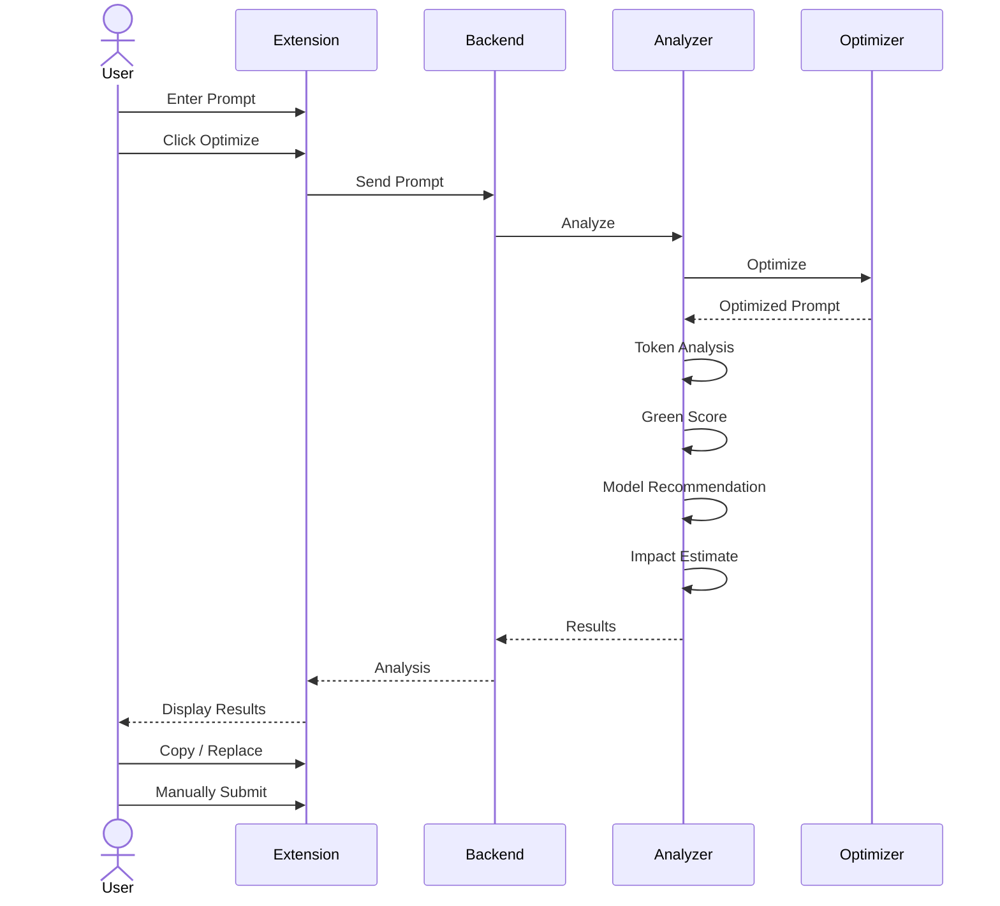

# 🌱 EcoRoute

### Think Green. Prompt Smart.

EcoRoute is an AI efficiency layer that helps users optimize prompts, reduce unnecessary token usage, choose suitable AI models, and understand the relative efficiency of their AI usage.

It includes a **web application** and a **Chrome browser extension** that brings EcoRoute directly into ChatGPT.

---

## ✨ Features

- 🌱 Prompt optimization
- 🔢 Token usage comparison
- 🍃 Green Score
- 🤖 Model recommendation
- 💡 AI necessity recommendation
- 🌍 Relative impact estimation
- 🧩 ChatGPT browser extension
- 📋 Copy / Replace optimized prompt
- 🔒 User-controlled prompt submission

---

# 🏗️ System Architecture



---

# 🔄 Core Workflow


---

# 🧩 Browser Extension Architecture



---

# 🧩 Extension User Flow



> **EcoRoute never automatically submits prompts. The user always reviews and controls the final action.**

---

# 🛠️ Tech Stack

| Layer | Technology |
|---|---|
| Frontend | React + Vite |
| Backend | Python + FastAPI |
| Extension | JavaScript + Chrome Manifest V3 |
| Styling | CSS / Tailwind |
| AI Processing | Prompt Optimization + Analysis |
| Version Control | Git + GitHub |

---

# 📁 Project Structure

```text
EcoRoute/
├── backend/
│   ├── main.py
│   ├── analyzer.py
│   ├── optimizer.py
│   ├── recommender.py
│   ├── token_counter.py
│   ├── impact.py
│   └── ...
│
├── extension/
│   ├── manifest.json
│   ├── background.js
│   ├── content.js
│   ├── content.css
│   ├── adapters/
│   ├── services/
│   └── ui/
│
├── public/
│   └── EcoRoute-v1.0.0.zip
│
├── src/
├── package.json
├── package-lock.json
├── vite.config.js
└── README.md
```

---

# 🚀 Setup

## Prerequisites

- Node.js 18+
- npm
- Python 3.10+
- Google Chrome / Chromium browser
- Git

---

## 🌐 Frontend

From the project root:

```bash
npm install
npm run dev
```

Open:

```text
http://localhost:5173
```

---

## ⚡ Backend

Open a new terminal:

```bash
cd backend
```

Create virtual environment:

### Windows

```bash
python -m venv venv
venv\Scripts\activate
```

### macOS / Linux

```bash
python3 -m venv venv
source venv/bin/activate
```

Install dependencies:

```bash
pip install -r requirements.txt
```

Run backend:

```bash
uvicorn main:app --reload
```

Backend:

```text
http://127.0.0.1:8000
```

API Docs:

```text
http://127.0.0.1:8000/docs
```

---

# 🧩 Chrome Extension Setup

### 1. Download

Download:

```text
EcoRoute-v1.0.0.zip
```

The ZIP is also available at:

```text
public/EcoRoute-v1.0.0.zip
```

### 2. Extract

After extracting, the folder should contain:

```text
manifest.json
background.js
content.js
content.css
adapters/
services/
ui/
```

`manifest.json` must be directly inside the folder.

### 3. Open Chrome Extensions

Go to:

```text
chrome://extensions
```

Enable **Developer mode**.

### 4. Load Extension

Click:

**Load unpacked → Select the folder containing `manifest.json`**

### 5. Start Backend

Make sure the backend is running:

```bash
uvicorn main:app --reload
```

### 6. Use EcoRoute

Open:

```text
https://chatgpt.com
```

Enter a prompt and click:

```text
🌱 Optimize
```

---

# 🔐 Environment Variables

Never commit API keys or secrets.

Create a local `.env` file:

```env
API_KEY=your_api_key_here
```

`.env` files are ignored by Git.

For production, configure secrets through your hosting platform.

---

# 🔄 API Flow



---

# 📊 Example

```text
Original Prompt
       ↓
   🔍 Analyze
       ↓
   ✨ Optimize
       ↓
 🔢 Token Comparison
       ↓
 🍃 Green Score
       ↓
 🤖 Model Recommendation
       ↓
 👤 User Review
       ↓
 💬 AI Tool
```

> Green Score and impact values are **relative estimates**, not precise scientific measurements of individual AI requests.

---

# 🛣️ Roadmap

- [x] Prompt optimization
- [x] Token analysis
- [x] Green Score
- [x] Model recommendation
- [x] AI necessity recommendation
- [x] ChatGPT extension
- [x] Copy / Replace prompt
- [x] Local extension setup
- [ ] Production backend
- [ ] Chrome Web Store release
- [ ] More AI platform integrations
- [ ] Improved optimization models

---

# 🌱 Vision

EcoRoute aims to make AI usage more intentional:

**Think → Analyze → Optimize → Right-size → Use AI**

### 🌱 Think Green. Prompt Smart.

---

## 👥 Team

Built by the **EcoRoute Team** as a hackathon project.

---

## 📄 License

This project is currently developed as a hackathon prototype.
